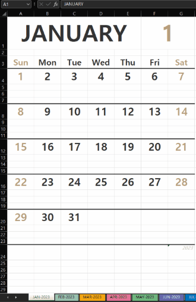

# Hodgepodge

## Generating monthly calendar for a year in excel file(.xlsx)

- source code: [**calendar_gen.py**](./python/calendar_gen.py)
- sample outputs: [**calendar-2022-JP.xlsx**](./python/examples/calendar-2022-JP.xlsx) / [**calendar-2022-KR.xlsx**](./python/examples/calendar-2022-KR.xlsx) / [**calendar-2022-FI.xlsx**](./python/examples/calendar-2022-FI.xlsx)
- screenshots:
- 

- Dependencies
    -[openpyxl 3.0.10][openpyxl] - A python library to read/write Excel 2010 xlsx/xlsm files

    ```bash
    pip install openpyxl
    ```
    _openpyxl is compatible to Python 3.6 or higher_

    - [python-holidays][python-holidays] - A python library for determining whether a specific date is a holiday.

    ```bash
    pip install holidays
    ```
    _python-holidays is compatible to Python 3.7 or higher_


- Usage:  
    
    a) Generate monthly calendar for the current year (*active tab: current month*)
    ```bash
    python calendar_gen.py 
    ```

    b) Generate calendar for the specific year (*active tab: January*)
     ```bash
    python calendar_gen.py [year]
    ```

    c) Generate calendar for the specific year (*active tab: given month*)
    ```bash
    python calendar_gen.py [year] [month]
    ```
    
<br><hr><br>

## Merging PDF files in the current working directory

- source code: [**merge_pdfs.py**](./python/merge_pdfs.py)

- Dependencies: [PyPDF2 2.1.0][PyPDF2] - A free and open-source pure-python PDF library

    ```bash
    pip install PyPDF2
    ```
    _PyPDF2 is compatible to Python 3.6 or higher_

- Usage:
    ```bash
    python merge_pdfs.py [filename]
    ```
<br><hr><br>

## Website Automation using Selenium 4
- Dependencies: [Selenium 4.3.0][Selenium], [webdriver-manager 3.7.0][webdriver-manager]

    ```bash
    pip install selenium==4.3.0
    pip install webdriver-manager
    ```
    _Selenium 4 will require a minimum Python 3.7 or higher_
    
    You should maintain your chrome browser up-to-date to match the chromedriver version with webdriver-manager.

1. [**Quasarzone point mining**](./python/quasarzone.py)
    - [QuasarZone][QuasarZone] perform attendance check and clicking banners

1. [**Kyobobook daily attendance**](./python/kyobobook.py)
    - [Kyobobook][Kyobobook] perform attendance check and bonus stamp
    - webdriver setting changed from Chrome to Firefox(gecko) as of June 30, 2022 to enhance stability

<br><hr><br>

[openpyxl]: https://openpyxl.readthedocs.io/en/stable/
[python-holidays]: https://python-holidays.readthedocs.io/en/latest/
[PyPDF2]: https://pypdf2.readthedocs.io/en/latest/
[Selenium]: https://www.selenium.dev/documentation/webdriver/
[webdriver-manager]: https://pypi.org/project/webdriver-manager/
[QuasarZone]: https://quasarzone.com/
[Kyobobook]: http://www.kyobobook.co.kr